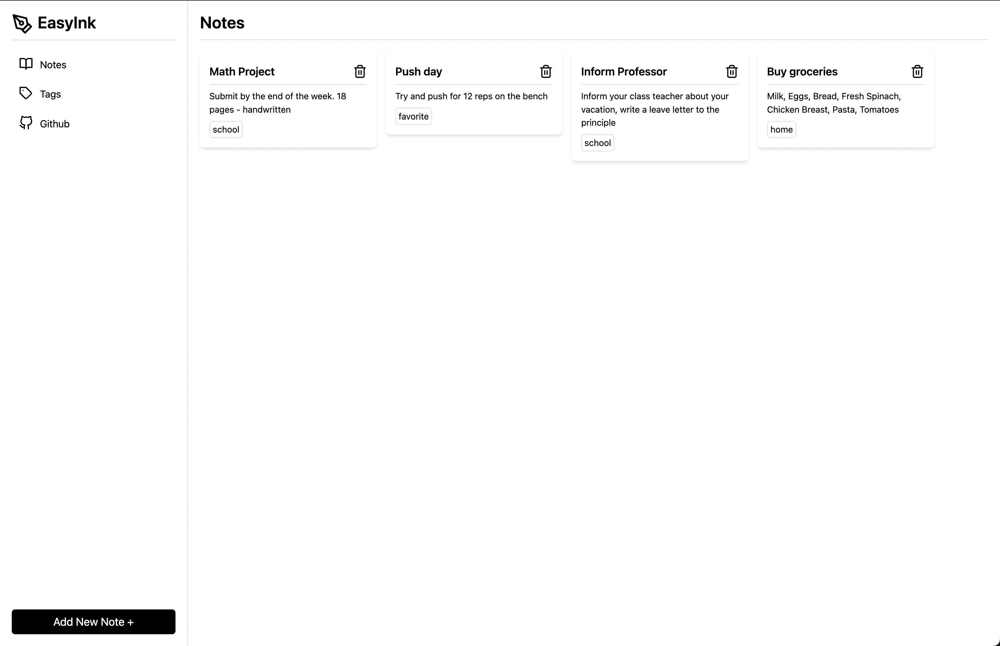
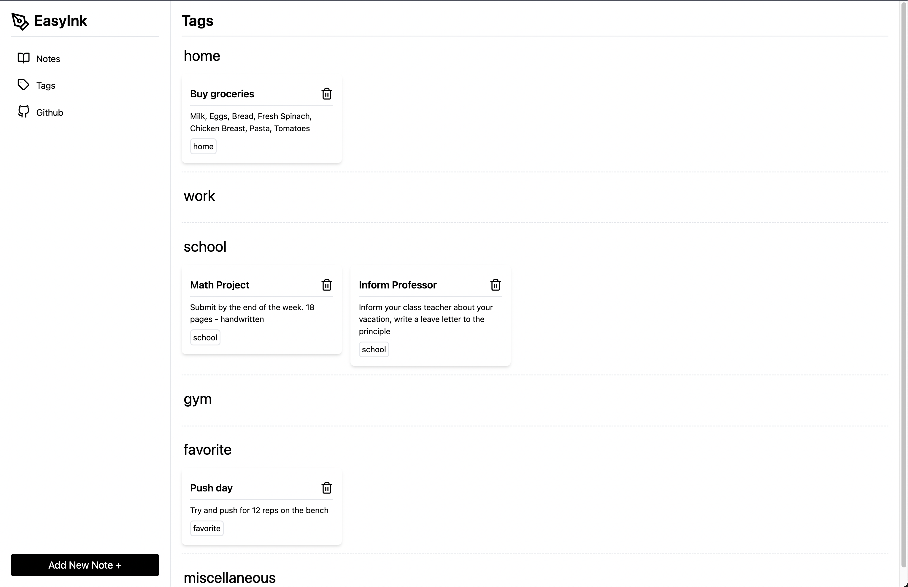

# EasyInk - An Advanced Note Taking App

EasyInk is an application that seamlessly blends simplicity with cutting-edge features to elevate your note-taking experience.




## Features:

1. Smart Categorization by tagging your notes.
2. Seamless and Lightning Fast UI
3. Retains your information when you restart the application.

Experience the future of note-taking with EasyInk — where simplicity meets sophistication, and your ideas are ready to flourish like never before.

This website has been deployed on [vercel](https://easy-ink-advanced-note-taking-app.vercel.app/)

---

## About the project

This project was bootstrapped with [Create React App](https://github.com/facebook/create-react-app).

The clean and seemless UI was built using [tailwindcss](https://tailwindcss.com/)

## Dependancies:

-   React
-   Tailwind
-   React Feather

## Development:

1. Clone the repository

    ```bash
    git clone https://github.com/iammohitvs/EasyInk-Advanced-Note-Taking-App
    ```

2. Install dependencies

    ```bash
    npm i
    ```

3. Run the project

    ```bash
    npm run start
    ```

---

Please do reach out with any sort of feedback, criticism, or advice. I'm extremely open to learning.

P.S. If somebody can figure out what is wrong with the sidenav when the modal to add a new note is opened please do let me know. I have spent a long time trying to figure it out but am not able to.

Note: I fixed it now. Some issue with its position being fixed. adjusted the dislay to be flex.
